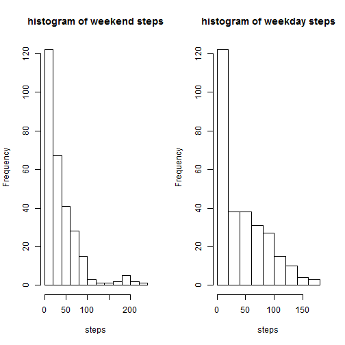

# Reproducible Research: Peer Assessment 1
<br><br>

## Pre-Requisites

<br>

The following packages are required:

* data.tables
* xtable
* lattice

the following R version was used to perform these calculations:

```r
xt <- version
#output results which include mean and median
print(xt, type='html')
```

               _                           
platform       x86_64-w64-mingw32          
arch           x86_64                      
os             mingw32                     
system         x86_64, mingw32             
status                                     
major          3                           
minor          1.0                         
year           2014                        
month          04                          
day            10                          
svn rev        65387                       
language       R                           
version.string R version 3.1.0 (2014-04-10)
nickname       Spring Dance                

## Loading and preprocessing the data

### Sources

<br>

The data for this assignment can be downloaded from the course web
site:

* Dataset: [Activity monitoring data](https://d396qusza40orc.cloudfront.net/repdata%2Fdata%2Factivity.zip) [52K]

The variables included in this dataset are:

* **steps**: Number of steps taking in a 5-minute interval (missing
    values are coded as `NA`)
* **date**: The date on which the measurement was taken in YYYY-MM-DD
    format
* **interval**: Identifier for the 5-minute interval in which
    measurement was taken

The dataset is stored in a comma-separated-value (CSV) file and there are a total of 17,568 observations in this dataset.

### Preparation

The dataset used to perform this analysis was downloaded from source on 

Steps to download and prepare the file are as follows:

1. Create a temp. file name (eg tempfile())
2. Use download.file() to fetch the file into the temp. file
3. Use unz() to extract the target file from temp. file
4. Remove the temp file via unlink()

no further preparation is immediately performed, since the some output requires analysis of `NA` values.

The data used to prepare this document was downloaded on Mon Jul 14 10:41:43 2014


```r
  temp <- tempfile()
  download.file("http://d396qusza40orc.cloudfront.net/repdata%2Fdata%2Factivity.zip",temp)
  data <- read.csv(unz(temp, "activity.csv"), header=T)
  unlink(temp)
```


## What is mean total number of steps taken per day?

For this part of the assignment,missing values in the dataset can be ignored.
histogram will igore `NA` values so no need to remove them, outputs are the same.

### Make a histogram of the total number of steps taken each day

First step here is to aggregate total steps for each day in the data set. We will use the a data table to speed up this process. In this case, we remove `NA` values from the sum.


```r
library(data.table)
dt<-data.table(data)
dt.agg <- dt[, sum(steps, na.rm=T), by=date]
hist(dt.agg$V1 , main="Histogram of Total Number of Steps /Day", xlab="steps")
```

 
<br>

2. Calculate and report the **mean** and **median** total number of steps taken per day
<br>


```r
library(xtable)
# Transpose summary table to a format xtable can use
dt.sum <- summary(dt.agg$V1)
dt.t <- t(t(dt.sum))
xt <- xtable(dt.t)
#output results which include mean and median
print(xt, type='html')
```

<!-- html table generated in R 3.1.0 by xtable 1.7-3 package -->
<!-- Mon Jul 14 10:41:47 2014 -->
<TABLE border=1>
<TR> <TH>  </TH> <TH> x </TH>  </TR>
  <TR> <TD align="right"> Min. </TD> <TD align="right"> 0.00 </TD> </TR>
  <TR> <TD align="right"> 1st Qu. </TD> <TD align="right"> 6780.00 </TD> </TR>
  <TR> <TD align="right"> Median </TD> <TD align="right"> 10400.00 </TD> </TR>
  <TR> <TD align="right"> Mean </TD> <TD align="right"> 9350.00 </TD> </TR>
  <TR> <TD align="right"> 3rd Qu. </TD> <TD align="right"> 12800.00 </TD> </TR>
  <TR> <TD align="right"> Max. </TD> <TD align="right"> 21200.00 </TD> </TR>
   </TABLE>
<br>

## What is the average daily activity pattern?


### Make a time series plot (i.e. `type = "l"`) of the 5-minute interval (x-axis) and the average number of steps taken, averaged across all days (y-axis)


```r
#get rid of NA values for mean calcs
d<-na.omit(dt)
dt.ave <- d[, mean(steps, na.rm=T), by=interval]
setnames(dt.ave,c('interval','steps'))
plot(dt.ave$interval,dt.ave$steps, type="l")
```

 

### Which 5-minute interval, on average across all the days in the dataset, contains the maximum number of steps?


```r
maxInterval <- dt.ave[dt.ave$steps==max(dt.ave$steps)]
xt <- xtable(maxInterval)
#output results which include mean and median
print(xt, type='html')
```

<!-- html table generated in R 3.1.0 by xtable 1.7-3 package -->
<!-- Mon Jul 14 10:41:48 2014 -->
<TABLE border=1>
<TR> <TH>  </TH> <TH> interval </TH> <TH> steps </TH>  </TR>
  <TR> <TD align="right"> 1 </TD> <TD align="right"> 835 </TD> <TD align="right"> 206.17 </TD> </TR>
   </TABLE>
<br>

Which indicates, the maximum interval is **835** with an average of **206.1698** steps 

## Imputing missing values

### Calculate and report the total number of missing values in the dataset (i.e. the total number of rows with `NA`s)

using the summary command, we see there are **2304** `NA` values.


```r
summary(data)
```

```
##      steps               date          interval   
##  Min.   :  0.0   2012-10-01:  288   Min.   :   0  
##  1st Qu.:  0.0   2012-10-02:  288   1st Qu.: 589  
##  Median :  0.0   2012-10-03:  288   Median :1178  
##  Mean   : 37.4   2012-10-04:  288   Mean   :1178  
##  3rd Qu.: 12.0   2012-10-05:  288   3rd Qu.:1766  
##  Max.   :806.0   2012-10-06:  288   Max.   :2355  
##  NA's   :2304    (Other)   :15840
```

### Devise a strategy for filling in all of the missing values in the dataset. 

Conventional Imputation typically uses multiple methods to substitutes estimated values for missing values

* Replacement with means
* Regression imputation (replace with conditional means)

The problem is that these methods 

* Often leads to biased parameter estimates (e.g., variances)
* Usually leads to standard error estimates that arebiased downward
  * Treats imputed data as real data, ignores inherent uncertainty in imputed values.

However, given that in this case the strategy does not need to be sophisticated. I have elected to replace all `NA` values with the mean value for that 5-minute interval. The dataset follows.

### Create a new dataset that is equal to the original dataset but with the missing data filled in.

The new dataset called `dt.impute` is created as follows:

1. Split the data set into two components, one with and one without `NA` values (`dt.noNA` and `dt.na` respectively)
2. merge the `dt.na` data set with the `dt.avg` set above, to get the average steps for the intervals in question
3. create a new dataset that replaces the `NA` values with the matched average step values
4. rbind the dt.noNA with the new dt.na data frame to create a complete table with no `NA` values


```r
dt.noNA <- data[!is.na(data$steps),]
dt.na <- data[is.na(data$steps),]
dt.m <- merge(x=dt.na, y=dt.ave, by='interval')
dt.impute <- rbind(dt.noNA, data.table(interval=dt.m$interval, steps=dt.m$steps.y, date=dt.m$date), use.names=T)
summary(dt.impute)
```

```
##      steps               date          interval   
##  Min.   :  0.0   2012-10-01:  288   Min.   :   0  
##  1st Qu.:  0.0   2012-10-02:  288   1st Qu.: 589  
##  Median :  0.0   2012-10-03:  288   Median :1178  
##  Mean   : 37.4   2012-10-04:  288   Mean   :1178  
##  3rd Qu.: 27.0   2012-10-05:  288   3rd Qu.:1766  
##  Max.   :806.0   2012-10-06:  288   Max.   :2355  
##                  (Other)   :15840
```

### Make a histogram of the total number of steps taken each day and Calculate and report the mean and median total number of steps taken per day.


```r
dt.aggImpute <- dt.impute[, sum(steps, na.rm=T), by=date]
hist(dt.aggImpute$V1 , main="Histogram of Total Number of Steps /Day")
```

 


```r
dt.sum <- summary(dt.aggImpute$V1)
dt.t2 <- t(t(dt.sum))
xt <- xtable(dt.t2)
#output results which include mean and median
print(xt, type='html')
```

<!-- html table generated in R 3.1.0 by xtable 1.7-3 package -->
<!-- Mon Jul 14 10:41:48 2014 -->
<TABLE border=1>
<TR> <TH>  </TH> <TH> x </TH>  </TR>
  <TR> <TD align="right"> Min. </TD> <TD align="right"> 41.00 </TD> </TR>
  <TR> <TD align="right"> 1st Qu. </TD> <TD align="right"> 9820.00 </TD> </TR>
  <TR> <TD align="right"> Median </TD> <TD align="right"> 10800.00 </TD> </TR>
  <TR> <TD align="right"> Mean </TD> <TD align="right"> 10800.00 </TD> </TR>
  <TR> <TD align="right"> 3rd Qu. </TD> <TD align="right"> 12800.00 </TD> </TR>
  <TR> <TD align="right"> Max. </TD> <TD align="right"> 21200.00 </TD> </TR>
   </TABLE>

We can see the median in the imputed data increases from 10,400 to 10,770. 
The mean has also increased from 9,354 in the original dataset to 10,400 in the imputed data set.
interestingly, the mean = median in the imputed dataset which is not the case in the original dataset.

## Are there differences in activity patterns between weekdays and weekends?

For this section, we'll use the dataset with the filled-in missing values. First we begin by converting the data column, currently a factor, to date format. In addition, we use the weekday function to create a Weekday/Weekend factor column in order to differentiate the data between the two.


```r
dt.impute$date<- as.Date(dt.impute$date, format = "%Y-%m-%d")
#now we use the weekday function to add day
dt.impute[, day := weekdays(date)][,isWeekend:=day %in% c('Saturday','Sunday')][,dayType :=factor(isWeekend,levels=c(F,T),labels=c('Weekday','Weekend'))]
```

```
##        steps       date interval     day isWeekend dayType
##     1: 0.000 2012-10-02        0 Tuesday     FALSE Weekday
##     2: 0.000 2012-10-02        5 Tuesday     FALSE Weekday
##     3: 0.000 2012-10-02       10 Tuesday     FALSE Weekday
##     4: 0.000 2012-10-02       15 Tuesday     FALSE Weekday
##     5: 0.000 2012-10-02       20 Tuesday     FALSE Weekday
##    ---                                                    
## 17564: 1.075 2012-10-08     2355  Monday     FALSE Weekday
## 17565: 1.075 2012-11-04     2355  Sunday      TRUE Weekend
## 17566: 1.075 2012-11-09     2355  Friday     FALSE Weekday
## 17567: 1.075 2012-10-01     2355  Monday     FALSE Weekday
## 17568: 1.075 2012-11-30     2355  Friday     FALSE Weekday
```

```r
#consolidate total steps
x <- dt.impute[,mean(steps), by=list(interval, dayType)]
setnames(x, c('interval','dayType','steps'))

library(lattice)
xyplot(x$steps ~ x$interval |
         x$dayType, layout = c(1, 2), type = "l", xlab = "Interval", ylab = "Number of steps")
```

 

```r
##show summary of two datasets

we<-x[x$dayType=='Weekend']
wd<-x[x$dayType=='Weekday']

#Weekday activity
#----------------
summary(wd)
```

```
##     interval       dayType        steps       
##  Min.   :   0   Weekday:288   Min.   :  0.00  
##  1st Qu.: 589   Weekend:  0   1st Qu.:  2.25  
##  Median :1178                 Median : 25.80  
##  Mean   :1178                 Mean   : 35.61  
##  3rd Qu.:1766                 3rd Qu.: 50.85  
##  Max.   :2355                 Max.   :230.38
```

```r
#Weekend activity
#----------------
summary(we)
```

```
##     interval       dayType        steps       
##  Min.   :   0   Weekday:  0   Min.   :  0.00  
##  1st Qu.: 589   Weekend:288   1st Qu.:  1.24  
##  Median :1178                 Median : 32.34  
##  Mean   :1178                 Mean   : 42.37  
##  3rd Qu.:1766                 3rd Qu.: 74.65  
##  Max.   :2355                 Max.   :166.64
```

```r
#Comparison histograms
par(mfrow=c(1,2))
hist(wd$steps, main="histogram of weekend steps", xlab='steps')
hist(we$steps, main="histogram of weekday steps", xlab='steps')
```

 

```r
par(mfrow=c(1,1))
```

Weekend activity does appear to be higher than weekday activity, evidenced by higher mean and median values. Weekday activity appears to have higher occurences of mid-range activity, whilst weekend activity appears to be have higher frequency on both tail sides of the distribution (i.e highly active, or not very little activity)
